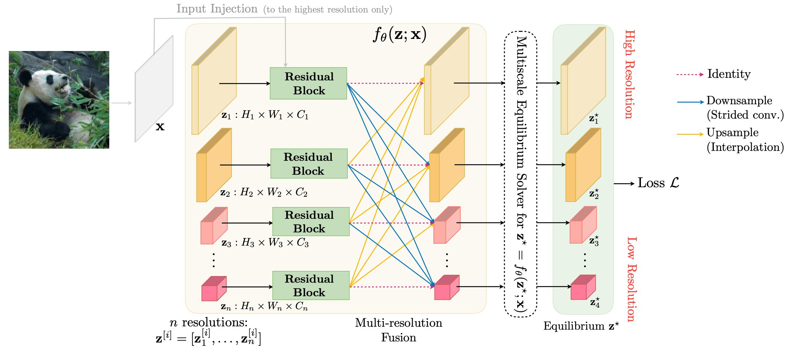
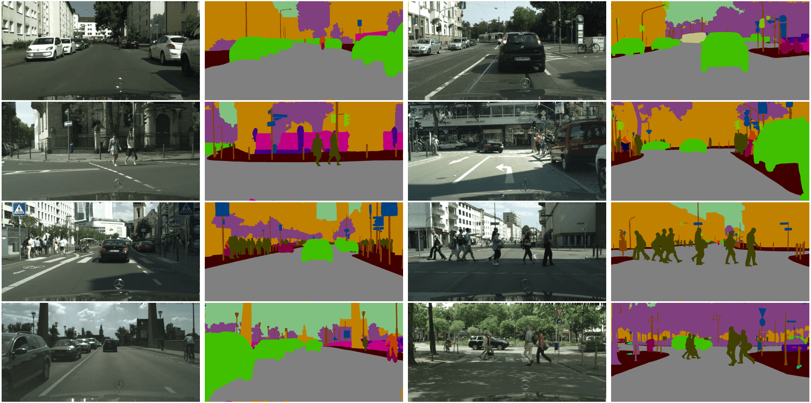

# Multiscale Deep Equilibrium Models

This repository __mainly__ contains the code for the multiscale deep equilibrium (MDEQ) model proposed in the paper [Multiscale Deep Equilibrium Models](https://arxiv.org/abs/2006.08656) by Shaojie Bai, Vladlen Koltun and J. Zico Kolter.

Is implicit deep learning relevant for general, large-scale pattern recognition tasks? We propose the multiscale deep equilibrium (MDEQ) model, which expands upon the DEQ formulation substantially to introduce simultaneous equilibrium modeling of multiple signal resolutions. Specifically, MDEQ solves for and backpropagates through synchronized equilibria of multiple feature representation streams. Such structure rectifies one of the major drawbacks of DEQ, and provide natural hierarchical interfaces for auxiliary losses and compound training procedures (e.g., pretraining and finetuning). Our experiment demonstrate for the first time that "shallow" implicit models can scale to and achieve near-SOTA results on practical computer vision tasks (e.g., megapixel images on Cityscapes segmentation).

We also provide additional support for regularizing the MDEQ models' stability, as introduced in the paper [Stabilizing Equilibrium Models by Jacobian Regularization](https://arxiv.org/abs/2106.14342).

If you find thie repository useful for your research, please consider citing our work:

```
@inproceedings{bai2020multiscale,
    author    = {Shaojie Bai and Vladlen Koltun and J. Zico Kolter},
    title     = {Multiscale Deep Equilibrium Models},
    booktitle = {Advances in Neural Information Processing Systems (NeurIPS)},
    year      = {2020},
}

@inproceedings{bai2021stabilizing,
  title     = {Stabilizing Equilibrium Models by Jacobian Regularization},
  author    = {Shaojie Bai and Vladlen Koltun and J. Zico Kolter},
  booktitle = {International Conference on Machine Learning (ICML)},
  year      = {2021}
}
```

### Overview

The structure of a multiscale deep equilibrium model (MDEQ) is shown below. All components of the model are shown in this figure (in practice, we use n=4).

<p align="center"/>

    
    
### Examples
    
Some examples of MDEQ segmentation results on the [Cityscapes](https://www.cityscapes-dataset.com/) dataset.

<p align="center"/>




### Requirements

PyTorch >=1.5.0, torchvision >= 0.4.0 recommended


### Datasets

- **CIFAR-10**: We download the CIFAR-10 dataset using PyTorch's torchvision package (included in this repo).
- **ImageNet** We follow the implementation from the [PyTorch ImageNet Training repo](https://github.com/pytorch/examples/tree/master/imagenet).
- **Cityscapes**: We download the Cityscapes dataset from its official website and process it according to [this repo](https://github.com/mcordts/cityscapesScripts). Cityscapes dataset additionally require a `list` folder that aligns each original image with its corresponding labeled segmented image. This `list` folder can be downloaded [here](https://drive.google.com/drive/folders/1nOOkjSaWQdEI4Q0ay3bnOQHWk7UIH_dV?usp=sharing).

All datasets should be downloaded, processed and put in the respective `data/[DATASET_NAME]` directory. The `data/` directory should look like the following:
```
data/
  cityscapes/
  imagenet/
  ...          (other datasets)
  list/        (see above)
```

### Usage

All experiment settings are provided in the `.yaml` files under the `experiments/` folder. Note that starting in the v2.0 DEQ repo, we support both Broyden's method and Anderson acceleration methods for solving the fixed point, and one can choose different solvers for forward and backward processes. For example, to use Anderson in forward and Broyden in backward, one can simply set `F_SOLVER` to `'anderson'` and `B_SOLVER` to `'broyden'` in the `.yaml` files.

##### 1. Train on image classification
To train an MDEQ classification model on ImageNet/CIFAR-10, do

```sh
python tools/cls_train.py --cfg experiments/[DATASET_NAME]/[CONFIG_FILE_NAME].yaml
```

##### 2. Train on semantic segmentation
To train an MDEQ segmentation model on Cityscapes, do

```sh
python -m torch.distributed.launch --nproc_per_node=4 tools/seg_train.py --cfg experiments/[DATASET_NAME]/[CONFIG_FILE_NAME].yaml
```
where you should provide the pretrained ImageNet model path in the corresponding configuration (`.yaml`) file. We provide a sample pretrained model extractor in `pretrained_models/`, but you can also write your own script.

##### 3. Generate segmentation results
Similarly, to test the model and generate segmentation results on Cityscapes, do

```sh
python tools/seg_test.py --cfg experiments/[DATASET_NAME]/[CONFIG_FILE_NAME].yaml
```
You can (and probably should) initiate the Cityscapes training with an ImageNet-pretrained MDEQ. You need to extract the state dict from the ImageNet checkpointed model, and set the `MODEL.PRETRAINED` entry in Cityscapes yaml file to this state dict on disk.

##### 4. Jacobian regularization
We also provide additional support for regularizing the stability of the MDEQ models. Specifically, we can do this efficiently by regularizing `||J_f||_F` at the equilibrium point (which characterizes fixed point models' stability) using the Hutchinson estimator. In practice, we can apply this regularization stochastically and adjust its strength dynamically. Please refer to the [Stabilizing Equilibrium Models by Jacobian Regularization](https://arxiv.org/abs/2106.14342) paper for more details.

The "regularized" version yaml settings are named `[CONFIG_FILE_NAME]_reg.yaml` (e.g., `experiments/cifar/cls_mdeq_LARGE_reg.yaml`). These Jacobian-related analysis/regularizations are controlled by the following entries:
  - `JAC_LOSS_WEIGHT`: The strength of Jacobian regularization, where we regularize `||J_f||_F`.
  - `JAC_LOSS_FREQ`: The frequency `p` of the stochastic Jacobian regularization (i.e., we only apply this loss with probaility `p` during training).
  - `PRETRAIN_JAC_LOSS_WEIGHT`: The strength of Jacobian regularization during pretraining.
  - `JAC_STOP_EPOCH`: No Jacobian regularization is applied after this many epochs. This is added to prevent domination of Jacobian regularization loss (e.g., if the main loss is 0.01 and the Jacobian loss is 0.05).
  - `JAC_INCREMENTAL`: If >0, then we increase the `jac_loss_weight` by 0.1 after every `jac_incremental` training steps.
  - `SPECTRAL_RADIUS_MODE`: If `True`, estimate the DEQ models' spectral radius when evaluating on the validation set.


### Pre-trained Models

We provide some reasonably good pre-trained weights here so that one can quickly play with DEQs without training from scratch.

| Description   | Task              | Dataset             | Model                   |
| ------------- | ----------------- | ------------------- | ----------------------- |
| MDEQ-XL | ImageNet Classification | ImageNet | [download (.pkl)](https://drive.google.com/file/d/1vcWnlb5yUXE-3VHiuVJdfRZVeyx0U9-W/view?usp=sharing) |
| MDEQ-XL | Cityscapes(val) Segmentation | Cityscapes | [download (.pkl)](https://drive.google.com/file/d/1Gu7pJLGvXBbU_sPxNfjiaROJwEwak2Z8/view?usp=sharing) |
| MDEQ-Small | ImageNet Classification | ImageNet | [download (.pkl)](https://drive.google.com/file/d/12ANsUdJJ3_qb5nfiBVPOoON2GQ2v4W1g/view?usp=sharing) |
| MDEQ-Small (reg.) | ImageNet Classification | ImageNet | download (.pkl) |
| MDEQ-Small | Cityscapes(val) Segmentation | Cityscapes | [download (.pkl)](https://drive.google.com/file/d/11DZfYhHNK_XC6-Uob1Pp2pStS5EhP5dF/view?usp=sharing) |

**I. Example of how to evaluate the pretrained ImageNet model**:
  1. Download the pretrained ImageNet `.pkl` file. (I recommend using the `gdown` command!)
  2. Put the model under `pretrained_models/` folder with some file name `[FILENAME]`.
  3. Run the MDEQ classification validation command:
```sh
python tools/cls_valid.py --testModel pretrained_models/[FILENAME] --cfg experiments/imagenet/cls_mdeq_[SIZE].yaml
```
For example, for **MDEQ-Small**, you should get >75% top-1 accuracy.

**II. Example of how to use the pretrained ImageNet model to train on Cityscapes**:
  1. Download the pretrained ImageNet `.pkl` file.
  2. Put the model under `pretrained_models/` folder with some file name `[FILENAME]`.
  3. In the corresponding `experiments/cityscapes/seg_MDEQ_[SIZE].yaml` (where `SIZE` is typically `SMALL`, `LARGE` or `XL`), set `MODEL.PRETRAINED` to `"pretrained_models/[FILENAME]"`.
  4. Run the MDEQ segmentation training command (see the "Usage" section above):
```sh
python -m torch.distributed.launch --nproc_per_node=[N_GPUS] tools/seg_train.py --cfg experiments/cityscapes/seg_MDEQ_[SIZE].yaml
```

**III. Example of how to use the pretrained Cityscapes model for inference**:
  1. Download the pretrained Cityscapes `.pkl` file
  2. Put the model under `pretrained_models/` folder with some file name `[FILENAME]`. 
  3. In the corresponding `experiments/cityscapes/seg_MDEQ_[SIZE].yaml`  (where `SIZE` is typically `SMALL`, `LARGE` or `XL`), set `TEST.MODEL_FILE` to `"pretrained_models/[FILENAME]"`.
  4. Run the MDEQ segmentation testing command (see the "Usage" section above):
```sh
python tools/seg_test.py --cfg experiments/cityscapes/seg_MDEQ_[SIZE].yaml
```


### Tips:

- To load the Cityscapes pretrained model, download the `.pkl` file and specify the path in `config.[TRAIN/TEST].MODEL_FILE` (which is `''` by default) in the `.yaml` files. This is **different** from setting `MODEL.PRETRAINED`, see the point below. 
- The difference between `[TRAIN/TEST].MODEL_FILE` and `MODEL.PRETRAINED` arguments in the yaml files: the former is used to load all of the model parameters; the latter is for compound training (e.g., when transferring from ImageNet to Cityscapes, we want to discard the final classifier FC layers). 
- The repo supports checkpointing of models at each epoch. One can resume from a previously saved checkpoint by turning on the `TRAIN.RESUME` argument in the yaml files.

